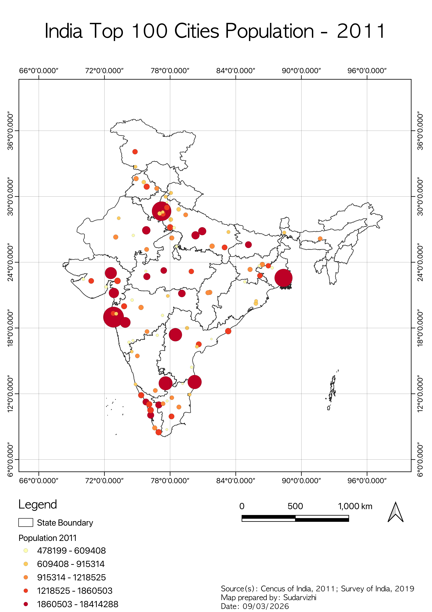
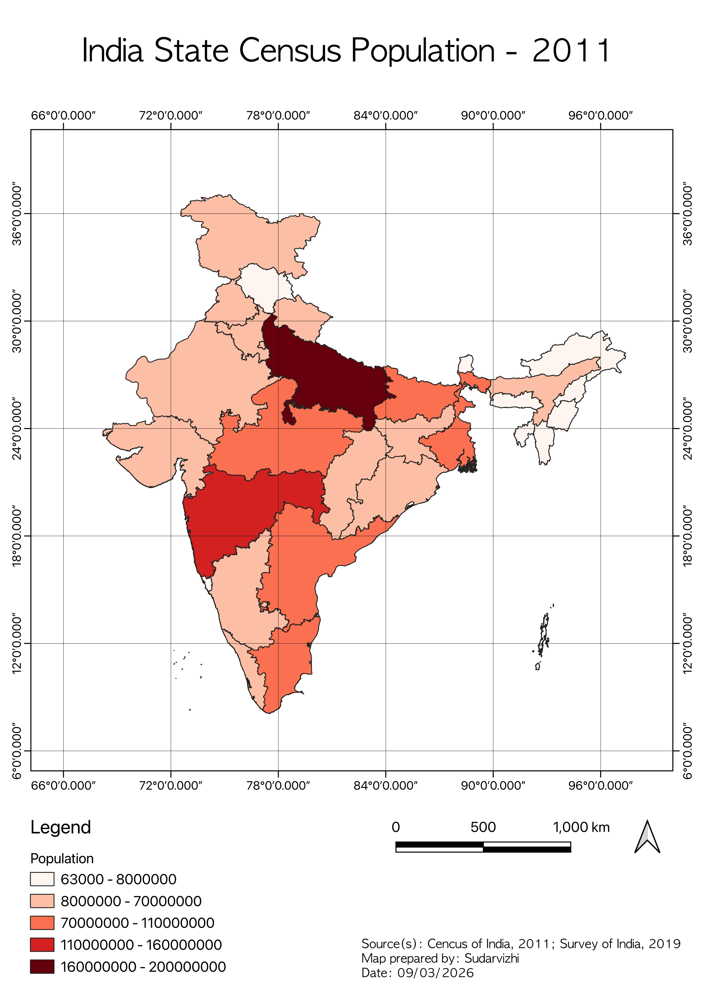
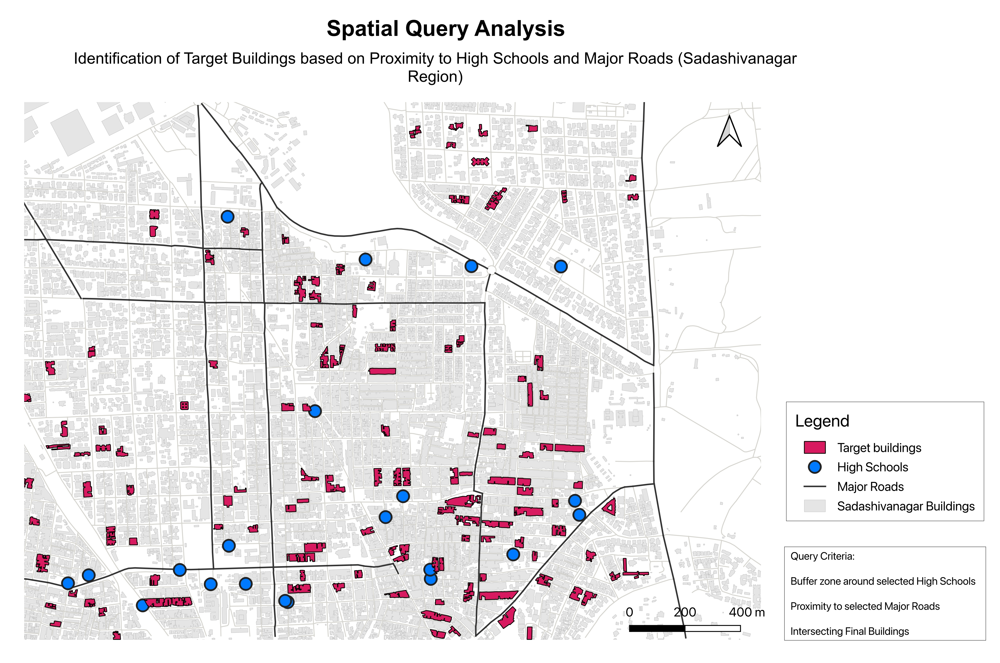
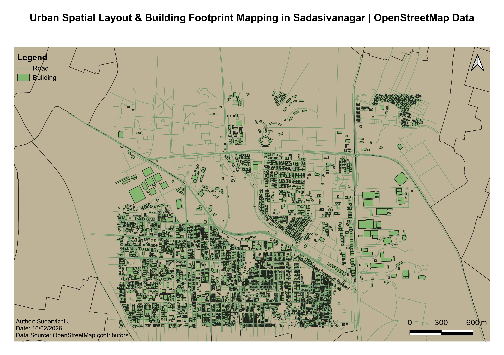

# 🗺️ GIS & Spatial Analysis Portfolio

Welcome to my GIS portfolio showcasing technical skills in terrain analysis, spatial queries, OpenStreetMap data extraction, raster georeferencing, and vector feature digitization using QGIS.

---

### 01. Terrain & Topographic Surface Analysis (Bengaluru)
- **Focus:** Raster Elevation Processing & Surface Modeling
- **Description:** Multi-panel topographic surface analysis of the Bengaluru region (BBMP boundary). Includes Digital Elevation Model (DEM) visualization, 3D contour generation, slope gradient calculation, and aspect orientation mapping.
- **Tools/Data:** QGIS, SRTM DEM, GDAL/GRASS Raster Tools.

---

### 02. India Top 100 Cities Population - 2011
- **Focus:** Proportional & Graduated Point Mapping
- **Description:** Spatial distribution mapping of India's top 100 populated urban centers using graduated point symbols categorized into five quantile density classes.
- **Tools/Data:** QGIS, Vector Point Layers, Census of India 2011.

---

### 03. India State Census Population - 2011
- **Focus:** Choropleth Mapping & Vector Layout Design
- **Description:** Categorical choropleth mapping representing state-level population distribution across India based on 2011 Census data. Features custom classification breaks, grid overlays, and standard cartographic elements.
- **Tools/Data:** QGIS, Survey of India Boundaries, Census 2011 Data.

---

### 04. Spatial Query & Proximity Analysis (Sadashivanagar)
- **Focus:** Vector Analysis & Multi-Criteria Decision Analysis (MCDA)
- **Description:** Spatial query modeling to identify target residential/commercial buildings based on spatial proximity criteria: buffer zones surrounding educational institutions (High Schools) and intersections with major road networks.
- **Tools/Data:** QGIS Vector Spatial Tools (Buffer, Intersect, Select by Location).

---

### 05. Urban Spatial Layout & Building Footprint Mapping (Sadashivanagar)
- **Focus:** OpenStreetMap (OSM) Data Extraction
- **Description:** Extraction and visualization of urban infrastructure layers including building footprints and road networks to analyze spatial density and street connectivity in Sadashivanagar.
- **Tools/Data:** QGIS, QuickOSM / OpenStreetMap contributors.

---

### 06. Georeferenced Vector Digitization & Spatial Feature Extraction
- **Focus:** Heads-Up Digitization & Multi-Geometry Extraction
- **Description:** Digitization of multi-geometry spatial features from georeferenced maps. Extracted point utilities (wells, posts, temples), linear transport networks (roads), and polygon land cover classes (forests, lakes, plantations).
- **Tools/Data:** QGIS Vector Digitization, Coordinate Reference Systems (CRS).

---

### 07. Raster Georeferencing & Toposheet Overlay
- **Focus:** Topographic Map Georeferencing & Satellite Validation
- **Description:** Georeferencing Survey of India Toposheet D43R8 over high-resolution satellite imagery for spatial registration, feature alignment, and multi-geometry vector validation across the Bengaluru region.
- **Tools/Data:** QGIS Georeferencer, Survey of India Toposheet, Google Satellite Basemap.

